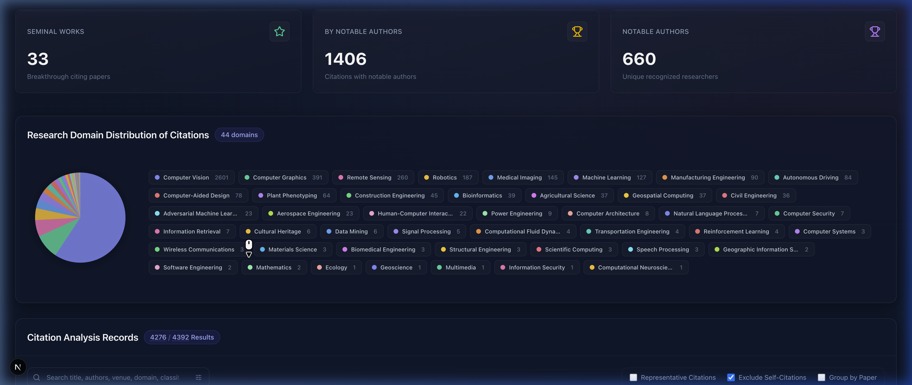

<h1 align="center">Citation Analyzer ✨</h1>

<p align="center">
  
  
  
  
</p>

<p align="center">
  <strong>🚀 Beyond the count: AI-driven insights into who is citing, how they're citing, and in which research domains.</strong>
</p>

<p align="center">
  <a href="docs/teaser.png"></a>
</p>

<p align="center">
  <a href="#quick-start">Quick Start</a> •
  <a href="#features">Features</a> •
  <a href="#project-structure">Project Structure</a> •
  <a href="#cli-reference">CLI Reference</a> •
  <a href="#testing">Testing</a> •
  <a href="#license">License</a>
</p>

---

## Quick Start

```bash
# 1. Clone
git clone https://github.com/yangyanli/citation_analyzer.git
cd citation_analyzer

# 2. Backend setup & Database Initialization
python3 -m venv venv
source venv/bin/activate
pip install -r backend/requirements.txt

# Initialize and seed the SQLite database with default credentials
python3 -c "from backend.database.sqlite_db import init_db; init_db()"
python3 backend/scripts/seed_db.py

# 3. Set your Gemini API key
echo "GEMINI_API_KEY=your_key_here" > .env

# 4. View the dashboard (Default Login: admin / admin)
cd frontend
npm install
npm run dev
# Open http://localhost:3000

# 🔑 Default Login Credentials:
# Username: admin
# Password: admin

# 5. Start the backend API server (in a new terminal)
source venv/bin/activate
python3 backend/server.py
# API runs at http://localhost:8000 with hot-reload scoped to backend/ only

# 6. Run the background pipeline (in a new terminal)
source venv/bin/activate
python3 backend/main.py --paper "A Structure for Deoxyribose Nucleic Acid" # Paper mode
python3 backend/main.py --user_id 145540632                                # S2 Author mode (numeric ID)
python3 backend/main.py --user_id JicYPdAAAAAJ                             # Google Scholar mode (alphanumeric ID)

# 7. View & Run Examples (Optional)
# If you want to test the pipeline on some authors:
bash scripts/run_examples.sh
```

## Features

| Feature                               | Description                                                                                                                                                             |
| ------------------------------------- | ----------------------------------------------------------------------------------------------------------------------------------------------------------------------- |
| 🎯 **Domain-Adaptive Criteria**       | Auto-infers research domain and generates tailored criteria for notability and seminal status                                                                           |
| 🔍 **5-Stage Author Verification**    | Catches LLM hallucinations via Homepage → Wikipedia → Verification URL → Google Scholar → LLM Second Opinion                                                            |
| 📊 **Sentiment Scoring**              | AI-generated 1–10 sentiment scores with evidence quotes                                                                                                                 |
| 🏆 **Notable Author Detection**       | Identifies National Academy members, prestigious award winners, and domain experts                                                                                      |
| ⭐ **Seminal Discovery Flagging**     | Highlights foundational works using configurable criteria (citation count, venue prestige, domain impact)                                                               |
| 🗂️ **Research Domain Classification** | Classifies citing papers into research domains via LLM, with interactive pie/bar chart visualization and click-to-filter                                                |
| 🌐 **Semantic Venue Resolution**      | Retrospectively scans the database to intelligently resolve arXiv preprints to their published, peer-reviewed venues via Semantic Scholar                               |
| 🔗 **Cross-Target Sharing**           | Automatically reuses sentiment scores, research domains, and resolved venues across analysis targets that share the same citing papers, eliminating redundant LLM calls |
| 💰 **Cost Estimation**                | Pre-run token cost estimates and extrapolated 10k batch projections across all Gemini models                                                                            |
| 🛡️ **Fallback Mode**                  | Pause the pipeline and inject structured JSON responses via the UI to save on LLM API costs or test alternative criteria inputs                                         |
| ⏸️ **Granular Run Controls**          | Admins can safely **Pause, Resume, or Cancel** multi-hour batch analysis jobs dynamically via the dashboard                                                             |
| 🔄 **Incremental Processing**         | Resume interrupted runs — all progress is cached                                                                                                                        |
| 🧪 **Phase Isolation & Data Wiping**  | Run specific pipeline phases independently and selectively wipe AI data for targeted re-runs without losing expensive citation graphs                                   |
| 📱 **Live Dashboard**                 | Next.js frontend with real-time data, sortable tables, and dark theme                                                                                                   |
| 📤 **One-Click Export**               | Export raw data (JSON/CSV), domain distribution charts, or self-contained HTML reports directly from the dashboard                                                       |
| 🖨️ **Print-Ready**                    | The entire dashboard renders cleanly on paper or PDF — white background, no interactive artifacts, readable tables                                                       |

## Export & Reporting

The dashboard includes a built-in **Export** menu (top-right corner) that lets you download analysis results in four formats without touching the terminal:

| Format                        | Description                                                                                                                              |
| ----------------------------- | ---------------------------------------------------------------------------------------------------------------------------------------- |
| **Raw Data (JSON)**           | Full citation records with all AI-generated fields (sentiment scores, domains, notable authors, evidence quotes) as a structured JSON    |
| **Raw Data (CSV)**            | Spreadsheet-compatible flat export of all citation records — ready for Excel, Google Sheets, or R/pandas                                 |
| **Domain Distribution (JSON)**| Domain chart data with sentiment breakdowns — the same format used by the embeddable chart component. Downloads as `domains.json`        |
| **Standalone Report (HTML)**  | A self-contained, single-file HTML report with inline CSS, SVG pie chart, metrics summary, and full citation table. Print-ready          |

> [!TIP]
> **Showcase**: The domain distribution export powers the live chart on [yangyan.li](http://yangyan.li) — a real-world example of embedding Citation Analyzer data into a static site.

### CLI Alternative

For automated pipelines or CI workflows, you can also export domain data from the command line:

```bash
python scripts/export_domains.py --target 9RxI7UAAAAAJ --output ~/path/to/domains.json
```

### Print Support

The dashboard is fully print-optimized. Press **⌘P** (macOS) or **Ctrl+P** (Windows/Linux) to get a clean, light-themed version with:

- White background with dark text
- All interactive controls hidden (buttons, filters, search, modals)
- Domain chart and metrics preserved with colors
- Citation table with clean borders and readable formatting

## Role-Based Access Control & Groups

The dashboard features a built-in Authentication and Group-based Access Control system to safely manage visibility and analysis triggers. This extends to granular control over expensive batch analysis tasks.

### User Roles

- **Viewer**: Can view public analysis targets and citations. Cannot initiate new analyses or edit data. (Default for visitors).
- **Editor**: Can view targets in their assigned groups, and edit citation metadata (e.g. sentiment scoring, venues).
- **Admin**: Can trigger new expensive AI analysis pipelines into their assigned groups, edit data, delete targets, and **Pause/Resume/Cancel** active background jobs.
- **Super Admin**: Has global access and controls system-level settings, User roles, and Group assignments.

### Walled-Garden Groups

Groups exist to isolate analysis targets from the broader public or other teams. An analysis target is always assigned to a specific group when it is created.

**Example Use Case (Research Lab):**

- **Public Showcase Group:** A group set to `Global Public View`. The principal investigator showcases a curated list of their most seminal research and notable citations here. Anyone visiting the lab's dashboard (even unauthenticated Viewers) can see them.
- **Private Project Groups:** Different sub-teams or projects in the lab (e.g., "Computer Vision", "Graphics") each have their own private group. They can track the citations of specific researchers or publications they are internally investigating. A researcher from the Vision project cannot see the Graphics project's private progress dashboard unless a Super Admin assigns them to both groups.

## Project Structure

```
citation-analyzer/
├── .agents/                         # Agentic IDE instructions and skills
│   └── skills/proxy/                # Optional AI fallback automation skill
├── backend/
│   ├── main.py                      # CLI entry point for analysis pipeline
│   ├── server.py                    # FastAPI Web Server for the dashboard
│   ├── api/                         # Clients for Gemini, S2, Google Scholar
│   ├── core/                        # Configuration, token costs, CLI logic
│   ├── database/                    # SQLite schema, auth, CRUD, caching & cross-target sharing
│   ├── pipeline/                    # AI classification phases (0–5)
│   ├── scripts/                     # Backend maintenance/setup scripts
│   ├── tests/                       # Pytest unit & integration tests
│   │   └── integration/             # Cross-validation integration tests
│   └── requirements.txt             # Python dependencies
├── frontend/                        # Next.js dashboard (TypeScript + Tailwind)
│   ├── src/app/                     # Next.js pages & routes
│   │   ├── api/                     # API proxy routes to FastAPI backend
│   │   ├── admin/                   # Admin pages (groups, users, logs)
│   │   ├── context/                 # React context providers (Auth)
│   │   └── login/ register/ settings/
│   ├── src/components/              # Modular UI components
│   ├── src/lib/                     # Shared utilities & helpers
│   ├── src/types/                   # TypeScript type definitions
│   └── tests/                       # Playwright E2E tests
├── data/                            # Runtime data (gitignored)
│   └── citation_analyzer.db         # Persistent SQLite Database
├── llm_calls/                       # LLM prompt/response logs (gitignored)
├── scripts/                         # General project scripts (run_examples.sh)
└── LICENSE                          # MIT License
```

## Data Sources: Hybrid Intelligence Methodology

Semantic Scholar is the universal backbone for citation graphs and context snippets. The tool supports three entry points depending on how you want to identify the analysis target:

| Mode                      | Flag                                    | Publication Source             |
| ------------------------- | --------------------------------------- | ------------------------------ |
| **S2 Author**             | `--user_id 145540632` (numeric)         | Semantic Scholar Author API    |
| **Google Scholar Author** | `--user_id JicYPdAAAAAJ` (alphanumeric) | Google Scholar via `scholarly` |
| **Single Paper**          | `--paper "Title"`                       | Direct S2 paper search         |

### How It Works

Regardless of entry point, every publication title is resolved to a **Semantic Scholar paper ID** (`paperId`). The S2 citations API then returns all citing papers with their exact **citation context sentences** — the raw text snippets the LLM uses for accurate sentiment analysis.

### Under the Hood: Discovery Logic

1.  **Publication Fetch**: S2 Author API → paper titles (numeric `--user_id`), Google Scholar profile → publication titles (alphanumeric `--user_id`), or direct title lookup (`--paper`).
2.  **Paper Resolution**: Each title is matched to a Semantic Scholar `paperId` via S2 search, with results cached in `s2_search_cache`.
3.  **Citation Collection**: S2 API returns all citing papers with context sentences. Each citation is keyed by `(citation_id, target_id)` — a composite primary key that allows the same citing paper to appear under multiple analysis targets.
4.  **Sentiment Scoring**: AI analyzes citation contexts to generate 1–10 sentiment scores and evidence quotes (Phase 4).
5.  **Domain Classification**: AI classifies each citing paper into a specific research domain (e.g., "Computer Vision", "Robotics") for aggregated visualization (Phase 5).
6.  **Cross-Target Sharing**: When the same `citation_id` exists under multiple targets, sentiment scores, research domains, and resolved venues are automatically shared to eliminate redundant LLM calls.

> [!NOTE]
> Semantic Scholar focuses on a curated, peer-reviewed index, which provides the high-quality text snippets required for meaningful AI sentiment analysis.

## How Author Verification Works

The LLM may hallucinate awards or fellowships. To catch this, every "notable" claim goes through a **5-stage verification pipeline**:

| Stage | Source               | What it checks                                                                                                                                                                               |
| ----- | -------------------- | -------------------------------------------------------------------------------------------------------------------------------------------------------------------------------------------- |
| 1     | Author Homepage      | Fetches the author's personal/lab page, looks for claimed keywords                                                                                                                           |
| 2     | Wikipedia            | Fetches the full article (not just the intro), searches for evidence. For abbreviated names (e.g., `H. Seidel`), uses the Wikipedia OpenSearch API to resolve them to their full name first  |
| 3     | LLM Verification URL | Sanitises and fetches a specific URL the LLM provided (e.g., a specific official award directory)                                                                                            |
| 4     | Google Scholar       | Fallback keyword search: `"Author Name" "claimed award"`. For abbreviated names, also tries surname-only queries                                                                             |
| 5     | LLM Second Opinion   | If web stages 1–4 all fail, a **second LLM call** is made. The LLM is told what verification was attempted and what failed, then asked to reconsider whether the author is genuinely notable |

Keyword matching is **word-level**, not exact substring — so "Fellow of the IEEE" correctly matches the keyword `"ieee fellow"`.

If the LLM second opinion also rejects the author, they are marked `[REJECTED - CONFIRMED]` and excluded from the notable list.

## CLI Reference

```
usage: main.py [-h] (--user_id USER_ID | --paper PAPER) [--delete] [--reset-db] [--resolve_arxiv] [--group_id GROUP_ID]
               [--system_user_id SYSTEM_USER_ID] [--total_citations_to_add TOTAL_CITATIONS_TO_ADD] [--estimate_only] [--model MODEL]
               [--domain DOMAIN] [--notable_criteria NOTABLE_CRITERIA] [--seminal_criteria SEMINAL_CRITERIA] [--start_phase START_PHASE]
               [--wipe_phase {2,3,4,5}] [--run_only_phase {0,1,2,3,4,5}] [--non-interactive] [--generate_criteria_only] [--config CONFIG]

Target (required - choose one):
  --user_id USER_ID                 Author ID: numeric for Semantic Scholar, alphanumeric for Google Scholar
  --paper PAPER                     Analyze a single paper by title (via Semantic Scholar)

Options:
  -h, --help                        show help message and exit
  --delete                          Delete the specified researcher or paper from the database
  --reset-db                        Drop all tables and purge the database before running
  --resolve_arxiv                   Trigger the retrospective arXiv venue resolution scan
  --group_id GROUP_ID               ID of the group this new analysis should belong to
  --system_user_id SYSTEM_USER_ID   The internal user ID triggering this analysis (for LLM logging)
  --total_citations_to_add TOTAL_CITATIONS_TO_ADD
                                    Target citations to analyze ('all' or integer limit)
  --estimate_only                   Estimate LLM cost without running queries
  --model MODEL                     LLM model (e.g. gemini-2.5-flash)
  --domain DOMAIN                   Override the inferred domain
  --notable_criteria NOTABLE_CRITERIA
                                    Override notable author criteria
  --seminal_criteria SEMINAL_CRITERIA
                                    Override seminal criteria
  --start_phase START_PHASE         Start pipeline at specific phase (0: Criteria, 1: Citations, 2: Authors, 3: Seminal, 4: Sentiment, 5: Domains)
  --wipe_phase {2,3,4,5}            Wipe AI and analysis data for a specific phase (2, 3, 4, or 5). Phase 1 cannot be wiped to preserve citation relations.
  --run_only_phase {0,1,2,3,4,5}    Only run this specific phase, instead of progressing through all subsequent phases.
  --non-interactive                 Run without user confirmation (useful for API triggers)
  --generate_criteria_only          Generate AI criteria and print to stdout as JSON, then exit
  --config CONFIG                   Path to JSON config file
```

### Database Management (Resetting Data)

If you need to clear the local SQLite database and start completely fresh, you can use the `--reset-db` flag. This is useful if you want to wipe cached domain-adaptive criteria, re-fetch citations, or clear old analysis targets.

```bash
# Example: Reset the database and start a fresh paper analysis
python3 main.py --paper "A Structure for Deoxyribose Nucleic Acid" --reset-db
```

### Config File Example

```json
{
  "domain": "Materials Science, Condensed Matter Physics",
  "notable_criteria": "National Academy of Sciences members, Nobel Laureates, highly cited researchers",
  "seminal_criteria": "Papers with 500+ citations, breakthrough discovery reports, or foundational reviews"
}
```

### Universal Logging & Fallback Intervention Mode

The system logs all input prompts and output responses to the `llm_calls/` directory for **EVERY** LLM call, regardless of whether it is successfully processed over the live API or handled via fallback.

If an input prompt cannot make it via the LLM API call (e.g., missing API keys, network timeout, or explicitly configured in Proxy/Fallback modes), the backend automatically enters a fallback intervention mode. It prints a structured `--- MANUAL FALLBACK TRIGGERED ---` alert to the terminal detailing exactly where the input prompt file is (e.g., `.txt`), where the native output response is supposed to be placed (`.json` or `.md`), and pauses execution. The system continuously polls the expected file location, waiting until the output is ready before proceeding.

**Dual-Resolution Mechanism**:
You can resolve this fallback in two ways:

1. **Terminal**: Write your response to the expected output path shown in the console, and the backend will automatically unblock.
2. **Frontend UI**: If you are using the Next.js dashboard, the UI will detect the paused state and display a "Fallback Intervention Required" modal. You can read the prompt and submit the response directly through the web interface, which writes the file for you.

## Cost Estimation

Before running, the tool estimates LLM costs across all Gemini models (phases 2–5):

```
--- ESTIMATED USAGE ---
Phase 2: Extracting 45 missing author profiles in 1 batches
Phase 3: Discovering seminal works among 200 citing papers in 7 batches
Phase 4: Classifying 30 un-cached citations in 1 batches
Phase 5: Domain classification for 30 citations in 1 batches
Estimated Tokens: ~12,400 Input / ~2,800 Output
```

| Model                   | Input $/1M | Output $/1M | Est. Cost | Extrapolated 10k Cost |
| ----------------------- | ---------- | ----------- | --------- | --------------------- |
| `gemini-2.0-flash-lite` | $0.075     | $0.30       | $0.00127  | $0.42                 |
| `gemini-2.0-flash`      | $0.100     | $0.40       | $0.00169  | $0.56                 |
| `gemini-2.5-flash-lite` | $0.100     | $0.40       | $0.00169  | $0.56                 |
| `gemini-2.5-flash`      | $0.150     | $0.60       | $0.00254  | $0.84 (default)       |
| `gemini-2.5-pro`        | $1.250     | $10.00      | $0.03163  | $10.54                |

## Testing

The project includes **307 unit and integration tests** ensuring high reliability (151 backend pytest tests and 156 frontend Playwright tests across 3 browsers):

```bash
# Backend (Python pipeline & integration tests)
python3 -m pytest --cov=backend backend/tests/

# Frontend (Agent/IDE Supervised E2E)
cd frontend
npm run test

# Frontend (Headless CI / GitHub Actions)
npm run test:coverage
```

### Backend Test Coverage

| Module                         | Tests | Coverage                                       |
| ------------------------------ | ----- | ---------------------------------------------- |
| `test_admin.py`                | 2     | Group deletion with member guard               |
| `test_cli.py`                  | 8     | Argparse & CLI flows                           |
| `test_config.py`               | 13    | Cross-target and fuzz name matching            |
| `test_cost_estimation.py`      | 7     | Tokens/Cost generation                         |
| `test_fallback_mechanisms.py`  | 3     | UI Proxy drops logic                           |
| `test_orchestrator.py`         | 23    | E2E Pipeline control logic, S2 author path     |
| `test_phase_0_criteria.py`     | 8     | JSON structuring criteria                      |
| `test_phase_1_citations.py`    | 6     | API search limits & logic                      |
| `test_phase_2_batch.py`        | 3     | Batch aggregation logic                        |
| `test_phase_2_verification.py` | 19    | 5-stage author verification pipeline           |
| `test_phase_3_seminal.py`      | 3     | Citing paper seminal discovery                 |
| `test_phase_4_sentiment.py`    | 13    | JSON parsing, sentiment classification         |
| `test_phase_5_domains.py`      | 12    | Domain classification, batch logic             |
| `test_sqlite_db.py`            | 17    | Composite PK, cross-target sharing, domain ops |
| `test_venue_resolver.py`       | 5     | arXiv resolution & cross-target venue sharing  |
| `test_export_domains.py`       | 9     | Domain export JSON structure & edge cases      |

## Contributing & Community

We love your input! We want to make contributing to this project as easy and transparent as possible.

- Please read our [Contributing Guidelines](CONTRIBUTING.md) for details on the process for submitting pull requests to us.
- Please note that this project is released with a [Contributor Code of Conduct](CODE_OF_CONDUCT.md). By participating in this project you agree to abide by its terms.
- For vulnerability reports and security issues, please see our [Security Policy](SECURITY.md).

## HTTPS Support

Citation Analyzer can be fully configured to run over HTTPS to secure authentication and API traffic.

### Local Development

To run the Next.js frontend over HTTPS locally, you can use Next.js's experimental HTTPS feature. It will automatically generate self-signed certificates:

```bash
cd frontend
npm run dev -- --experimental-https
```

For the backend, you can pass standard SSL keyfiles to Uvicorn if you've generated certificates (e.g., using `mkcert`):

```bash
uvicorn backend.server:app --ssl-keyfile key.pem --ssl-certfile cert.pem
```

### Production

For production deployments, the best practice is to place the Citation Analyzer behind a reverse proxy that handles the SSL/TLS termination automatically.

**Caddy Example (`Caddyfile`):**

```caddyfile
analytics.yourdomain.com {
    reverse_proxy /api/* localhost:8000
    reverse_proxy * localhost:3000
}
```

Caddy will automatically fetch and manage SSL certificates from Let's Encrypt, securing the dashboard and backend APIs without any code changes required.

## Future Work & Roadmap

To further improve the accuracy and depth of the citation analysis, the following areas have been identified for future development:

### 1. Advanced Data Integration

- **Alternative Data Providers**: Integrate with **OpenAlex** and **ORCID** APIs to expand citation coverage, cross-reference author identities, and eliminate name collision issues.
- **Recursive Notability (PageRank)**: Implement a graph-based evaluation for researcher impact, where a citation is weighted higher if it comes from an author who is themselves heavily cited by other notable researchers.

### 2. Deep Document Analysis

- **Full-Text PDF Extraction**: Automate the retrieval of Open Access PDFs (via Unpaywall) to perform deep full-text analysis instead of relying solely on abstracts.
- **Section-Aware AI Weighting**: Differentiate between citations in the **Introduction** (related work) vs. the **Experimental Results** or **Conclusion** (methodological dependency) to more accurately signify impact.

### 3. Infrastructure & Ecosystem

- **Interactive Citation Networks**: Build dynamic node-based visualizations within the Next.js dashboard using D3.js or React Flow to visually map out seminal paper propagation.
- **Containerization**: Provide official Docker images and Compose files to seamlessly deploy the SQLite + Next.js + Python stack in any cloud environment.

### 4. AI Consensus & Calibration

- **Committee of LLMs**: Run sentiment and seminal classification through a multi-model consensus pipeline (e.g., Gemini 2.5 Pro + GPT-4o + Claude 3.5 Sonnet) to reduce individual model bias.
- **Human-in-the-Loop Auto-Tuning**: Allow researchers to mark a small subset of citations as "Correct/Incorrect" in the dashboard, enabling the LLM to auto-adjust its domain criteria dynamically over time.

---

## License

This project is licensed under the MIT License — see [LICENSE](LICENSE) for details.
